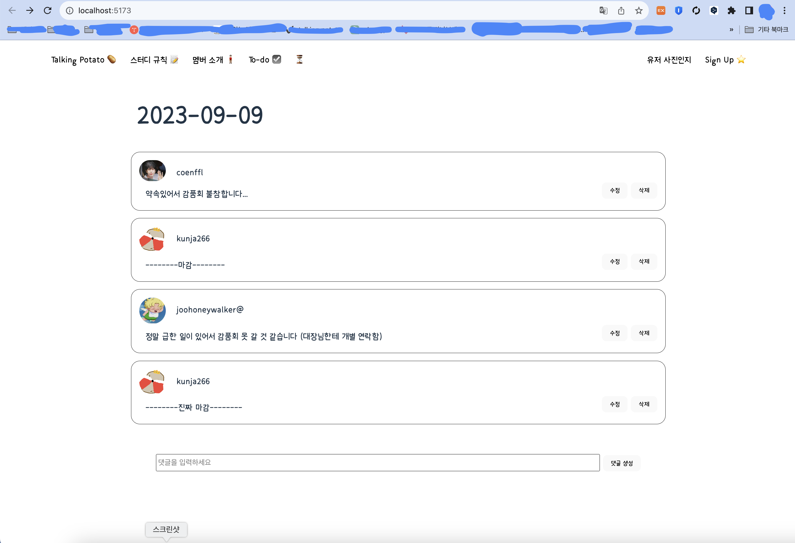

뭔가 남기지 않으면 안될것 같아서 지금이라도 써보기

## 230910 새벽
navbar와 라우팅을 끝냈고,  
아 아니다 라우팅 children 오류가 자꾸 빨간색으로 표시가 되는데   
그렇다고 children을 안넣어주면 오류가 나고 다시...   
그거 예지님한테 여쭤봐야겠다.   
권한 사용자한테만 보여지는 페이지 처리 이런거는   
권한 백에서 만들어주면 그 때 다시 설정하는걸로!   
로그인도 그때...!   
css는 고유 명칭으로 싹 바꿔야 한다고 해서 공부를 좀 해야할 것 같다.  
댓글도 아직 백이랑 연결 안한거랑,  
수정할 때 해당 댓글 컴포넌트에서 바로 내용을 수정할 수 있게 바꾸고 싶은데  
아직 안 만들었다.  
그래도 css 얼추 만들어졌고,  
여기에 라이트/다크 모드가 기본으로 css에 들어가 있어서 그거를 좀 바꿔주는게 헷갈린다.  
기본이 다크인 것을 잊지말자!  

 

